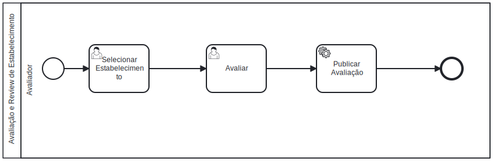

   ### 3.3.1 Processo 1 – Avaliação e Review de Estabelecimentos

O processo de Avaliação e Review de Estabelecimentos visa simplificar a interação do Avaliador com a plataforma, permitindo que ele avalie os estabelecimentos de maneira intuitiva. A proposta é criar um fluxo que facilite desde a seleção de um local até a publicação da avaliação, garantindo que o Avaliador possa fornecer sua opinião de maneira eficiente e que o sistema publique essas informações de forma transparente.

#### Detalhamento das atividades

### 1. **Selecionar Estabelecimento**
**Descrição**: O Avaliador seleciona o estabelecimento que deseja avaliar em uma lista exibida pela plataforma. Os estabelecimentos são filtrados com base nas tags e categoria. A lista é apresentada em uma ordenação personalzada logicamente para que a visualização seja sempre primeiramente com os estabelecimentos com as maiores notas e depois os menores, mantendo o propósito de visualização em forma de ranking, mesmo quando é selecionado a opção de busca por nome do estabelecimento.
  
**Objetivo**: Permitir que o Avaliador selecione facilmente o estabelecimento que deseja avaliar, simplificando o processo de escolha.
     
| **Campo**                  | **Tipo**           | **Restrições**                            | **Valor default**                  |
|-------------------------|----------------|---------------------------------------|--------------------------------|
| Nome do Estabelecimento      | Texto | Obrigatório |                              |
| Descrição     | Seleção única  | Obrigatório |                              |
| Filtro por Tags | Seleção única |           |                 |
| Filtro por Categoria | Seleção única |           |                 |
| Campo de pesquisa | Caixa de Texto |           |                 |

| **Comando**           | **Destino**                             | **Tipo** |
|-----------------------|-----------------------------------------|----------|
| Avaliar               | Modal de avalição                         | next     |
| Ver mais              | Abre o perfil do estabelecimento          | next   |
| Adicionar tag         | Filtra a visualização dos estabelecimentos de acordo com a tag selecionada                 | action   |
| Buscar Estabelecimento  | Pesquisa por nome e exibe o estabelecimento correspondente  | action   |

---

### 2. **Avaliar**
**Descrição**: O Avaliador insere a avaliação do estabelecimento selecionado, fornecendo informações sobre sua experiência. A avaliação inclui uma nota (de 0 a 5), um comentário detalhado e a possibilidade de incluir fotos da visita. O campo "Comentário" é limitado em 255 caracteres para manter as avaliações objetivas e evitar excesso de informação.
     
**Objetivo**: Coletar uma avaliação detalhada do estabelecimento, incluindo informações qualitativas e quantitativas, que servirão como base para futuras interações de outros usuários.

| **Campo**             | **Tipo**           | **Restrições**          | **Valor Default**      | 
|-----------------------|------------------- |--------------------------|------------------------|
| Nota                  | Seleção única      | Obrigatório              | 0                      |
| Comentário            | Caixa de Texto     | Obrigatório             |                        |
| Imagem                | Imagem             | Opcional                         |                        |

| **Comando**           | **Destino**                             | **Tipo** |
|-----------------------|-----------------------------------------|----------|
| Enviar                | Publicar Avaliação                      | default  |
| Cancelar              | Fim do Processo                         | cancel  |

---
