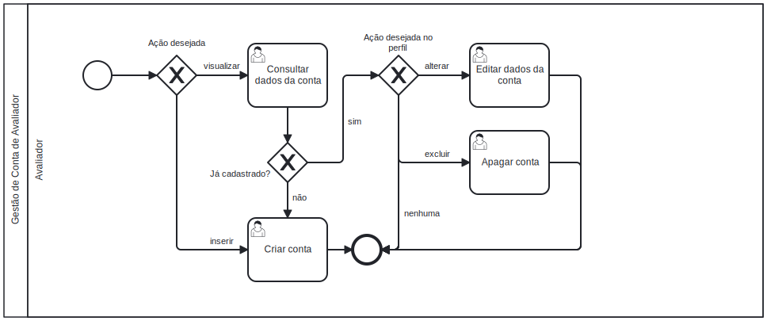

### 3.3.2 Processo 2 – Gestão de Conta Avaliador 

O processo de Gestão de Conta de Avaliador tem como principal objetivo facilitar a adesão de avaliadores à plataforma Gostô? por meio de um cadastro simples e oferecer formas práticas de manutenção da conta. Assim, busca-se aumentar a participação dos Avaliadores na plataforma, promovendo uma experiência mais fluida e acessível.

#### Detalhamento das atividades

---
### 1. **Consultar Dados da Conta**
**Descrição**: O Avaliador tem a opção de acessar seu perfil na plataforma para visualizar todas as informações que foram cadastradas anteriormente. Esta funcionalidade permite ao avaliador conferir se os dados estão corretos e atualizados, o que é essencial para manter a confiabilidade da conta. O acesso fácil a essas informações contribui para uma melhor experiência do usuário, já que o avaliador pode rapidamente revisar seus dados sem complicações.
     
**Objetivo**: Visualizar as informações cadastradas de forma clara. A consulta dos dados ajuda a evitar erros que poderiam surgir na utilização da conta, garantindo que o avaliador tenha um registro preciso de suas informações e que a comunicação com a plataforma seja efetiva.

| **Campo**             | **Tipo**           | **Restrições**          | **Valor Default**       |
|-----------------------|-------------------|-------------------------|-------------------------|
| Nome do Avaliador     | Caixa de Texto     | Apenas leitura          |                         |
| E-mail                | Caixa de Texto     | Apenas leitura          |                         |
| Telefone              | Caixa de Texto     | Apenas leitura          |                         |
| Data de Nascimento    | Data               | Apenas leitura          |                         |
| Foto do Avaliador     | Imagem             | Apenas leitura          |                         |
| Foto de Banner Perfil | Imagem             | Apenas leitura          |                         |

| **Comando**           | **Destino**                             | **Tipo** |
|-----------------------|-----------------------------------------|----------|
| Editar                | Direciona ao formulário de edição      | action   |
| Excluir            | Direciona para a página de excluir a Conta     | action   |

---

### 2. **Preencher Formulário de Cadastro**
**Descrição**: O Avaliador inicia seu registro na plataforma ao preencher um formulário de cadastro. Esse formulário é crucial para coletar informações pessoais e de contato que permitirão a identificação e o gerenciamento adequado da conta do avaliador. O avaliador deve fornecer dados como nome, e-mail, telefone, data de nascimento e uma foto. Esses dados são essenciais para garantir a autenticidade da conta e para facilitar futuras interações na plataforma.
  
**Objetivo**: Criar um registro no sistema vinculado ao avaliador, o registro permite que o avaliador tenha acesso a funcionalidades exclusivas da plataforma.
     
| **Campo**             | **Tipo**           | **Restrições**           | **Valor Default**       |
|-----------------------|-------------------|--------------------------|-------------------------|
| Nome do Avaliador     | Caixa de Texto     | Obrigatório              |                         |
| E-mail                | Caixa de Texto     |  Obrigatório                        |
| Telefone              | Caixa de Texto     |  Obrigatório                        |                         |
| Data de Nascimento    | Data               | Obrigatório              |                         |
| Senha                 | Caixa de texto     | Obrigatório              |                         |

| **Comando**           | **Destino**                             | **Tipo** |
|-----------------------|-----------------------------------------|----------|
| Cadastre-se            | Confirmação e validação de cadastro     | default  |

---

### 3. **Editar Conta**
**Descrição**: Após consultar os dados da conta, o Avaliador pode identificar a necessidade de atualizar suas informações pessoais ou de contato. Isso é fundamental, pois as informações podem mudar ao longo do tempo, como um novo número de telefone ou um endereço de e-mail. O formulário de edição permite ao avaliador realizar essas alterações de maneira simples e rápida, garantindo que seus dados estejam sempre atualizados.
     
**Objetivo**: Atualizar informações do cadastro previamente salvo no sistema. Manter as informações corretas é crucial para a comunicação eficaz com a plataforma e para a gestão das interações do avaliador com outros usuários.

| **Campo**             | **Tipo**           | **Restrições**         | **Valor Default**       |
|-----------------------|-------------------|-------------------------|-------------------------|
| Nome do Avaliador     | Caixa de Texto     | Obrigatório             |                        |
| E-mail                | Caixa de Texto     |  Obrigatório                       |                        |
| Telefone              | Caixa de Texto     |                         |                        |
| Data de Nascimento    | Data               | Obrigatório             |                        |
| Foto do Avaliador     | Imagem             |                         |                        |
| Foto de Banner Perfil | Imagem             | Apenas leitura          |                         |

| **Comando**           | **Destino**                             | **Tipo** |
|-----------------------|-----------------------------------------|----------|
| Salvar                | Valida e atualiza os dados              | default  |

---

## 4. **Excluir a Conta**
**Descrição**: Quando o Avaliador decide encerrar sua conta, ele pode acessar a opção de exclusão. Esta ação é irreversível e requer confirmação explícita do avaliador para garantir que a decisão foi intencional. A exclusão da conta resulta na remoção permanente de todos os dados associados ao avaliador, e essa funcionalidade é essencial para garantir que o avaliador tenha controle total sobre sua presença na plataforma.
     
**Objetivo**: Encerrar a conta e remover permanentemente os dados do avaliador do sistema. Isso assegura a privacidade do usuário e permite que ele se sinta seguro em gerenciar sua conta.

| **Campo**             | **Tipo**          | **Restrições**                         | **Valor Default**       |
|-----------------------|-------------------|----------------------------------------|-------------------------|
| Confirmação           | Seleção única     | Obrigatório                            |                         |
| Senha                 | Caixa de Texto    | Obrigatório                            |                         |

| **Comando**           | **Destino**                             | **Tipo** |
|-----------------------|-----------------------------------------|----------|
| Excluir               | Excluir conta e dados                   | default  |
| Cancelar              | Cancela a exclusão                      | cancel   |

---
