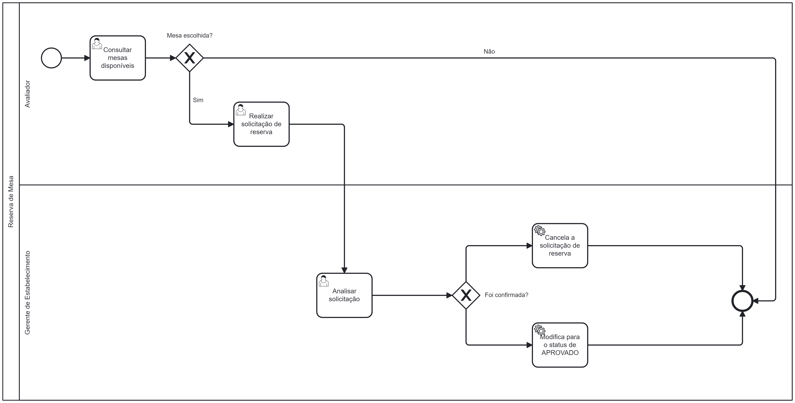

### 3.3.3 Processo 3 – Reserva de mesa

#### Detalhamento das atividades

### 1. **Consultar mesas disponíveis**
**Descrição**: O avaliador pode consultar as mesas do estabelecimento antes de fazer sua reserva.
     
**Objetivo:** Apresentar todas as mesas e suas informações para o avaliador escolher qual se encaixa melhor em sua necessidade.
  
| **Campo**            | **Tipo**         | **Restrições**                | **Valor Default** |
|----------------------|------------------|-------------------------------|-------------------|
| Nome da Mesa         | Texto            |  Apenas leitura               |                   |
| Descrição da Mesa    | Texto            |  Apenas leitura               |                   |
| Capacidade           | Numeral          |  Apenas leitura               |                   |

| **Comandos**         | **Destino**                             | **Tipo**          |
|----------------------|-----------------------------------------|-------------------|
| Reservar             | Encaminha para a solicitação de reserva | action            |

---

### 2. **Realizar a solicitação de reserva de mesa**
**Descrição:** Nesta atividade, o avaliador escolhe a data e o horário que deseja reservar.

**Objetivo:** Finalizar o processo de escolha da mesa pelo cliente e enviar o pedido de reserva para o sistema, garantindo que a informação seja registrada corretamente e que a mesa escolhida seja reservada exclusivamente para o cliente.

| **Campo**            | **Tipo**         | **Restrições**                   | **Valor Default** |
|----------------------|------------------|----------------------------------|-------------------|
| Nome da Mesa         | Texto            |  Apenas leitura                  |                   |
| Data                 | Data             |  Deve ser posterior ao dia atual |                   |
| Hora                 | Hora             |                                  |                   |

| **Comandos**          | **Destino**                    | **Tipo**          |
|-----------------------|--------------------------------|-------------------|
| Confirmar Reserva     | Conclui a reserva              | confirm           |
| Cancelar              | Encerra o processo             | cancel            |

---

### 3. **Analisar a solicitação**
**Descrição:** O Gerente de estabelecimento vai analisar solicitações de reserva de mesas, verificando os detalhes como data, hora e número de mesas solicitadas. Todos os campos são exibidos em modo de leitura para facilitar a revisão da solicitação antes de aprová-la ou recusá-la.

**Objetivo:** Permitir ao Gerente de estabelecimento revisar com precisão a solicitação de reserva antes de confirmar ou rejeitar a mesma.

| **Campo**            | **Tipo**         | **Restrições**                | **Valor Default** |
|----------------------|------------------|-------------------------------|-------------------|
| Nome da Mesa         | Texto            |  Apenas leitura               |                   |
| Data                 | Data             | Apenas leitura                |                   |
| Hora                 | Hora             | Apenas leitura                |                   |
| Nome do Avaliador    | Caixa de Texto   | Apenas leitura                |                   |

| **Comandos**         | **Destino**                    | **Tipo**          |
|----------------------|--------------------------------|-------------------|
| Aprovar reserva      | Encerra o processo             | confirm           |
| Rejeitar reserva     | Encerra o processo             | reject            |

---
