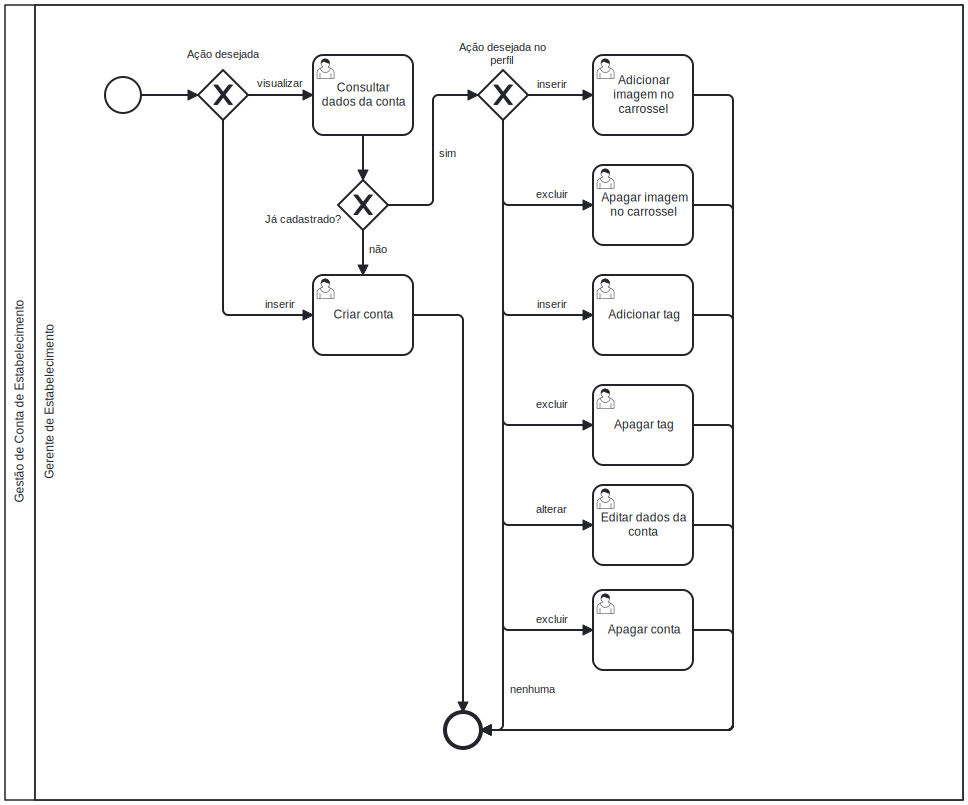

### 3.3.4 Processo 4 – Gestão de Conta de Estabelecimento 

O processo de Gestão de Conta de Estabelecimento tem como principal objetivo permitir a entrada de estabelecimentos na plataforma Gostô? por meio de um simples cadastro e, posteriormente, simples formas de manutenção de conta. Desta forma, aumenta-se a adesão à plataforma por parte dos Gerentes dos Estabelecimentos.

#### Detalhamento das atividades

### 1. **Consultar Dados da Conta**
**Descrição**: O Gerente de Estabelecimento acessa o perfil do estabelecimento onde pode visualizar os detalhes previamente cadastrados do seu negócio, permitindo que ele consulte as informações anteriormente cadastradas.
     
**Objetivo**: Visualizar de forma clara as informações cadastradas.

   | **Campo**       | **Tipo**         | **Restrições**        | **Valor default** |
   | ---             | ---              | ---                   | ---               |
   | Nome do Estabelecimento | Caixa de Texto     | Apenas leitura        |         |
   | Endereço do Estabelecimento   | Área de Texto      | Apenas leitura      |     |
   | Foto/Logotipo   | Imagem             | Apenas leitura        |                 |
   | Foto de Banner Perfil	| Imagem  |	Apenas leitura	
   | E-mail          | Caixa de Texto     | Apenas leitura        |                 |
   | Telefone        | Caixa de Texto     | Apenas leitura        |                 |
   | Categoria       | Caixa de Texto     | Apenas leitura        |                 |
   | Tags       | Botão    | Apenas leitura        |                 |

| **Comando**           | **Destino**                             | **Tipo** |
|-----------------------|-----------------------------------------|----------|
| Editar                | Direciona ao formulário de edição      | action   |
| Excluir            | Direciona para a página de excluir a Conta     | action   |

---

### 2. **Preencher Formulário de Cadastro**
**Descrição**: O Gerente de Estabelecimento realiza o primeiro contato com o sistema, fornecendo todas as informações essenciais para criar um cadastro válido. O formulário inclui informações sobre o estabelecimento, como nome, endereço, contato e uma imagem representativa.
     
**Objetivo**: Criar um registro no sistema vinculado ao estabelecimento do gerente.

   | **Campo**       | **Tipo**           | **Restrições**           | **Valor default** |
   | ---             | ---                | ---                      | ---               |
   | Nome do Estabelecimento | Caixa de Texto     | Obrigatório      |                   |
   | Endereço        | Área de Texto      | Obrigatório              |                   |
   | E-mail          | Caixa de Texto     | Obrigatório              |                   |
   | Telefone        | Caixa de Texto     | Obrigatório              |                   |
   | Categoria       | Seleção única      | Obrigatório              |                   |
   | Senha           | Caixa de Texto     | Obrigatório              |                   |

   | **Comandos**         | **Destino**                          | **Tipo** |
   | ---                  | ---                                  | ---      |
   | Enviar               | Confirmação e validação de cadastro  | default  |
   | Cancelar             | Voltar para a homepage               | cancel   |

---

### 3. **Editar**
**Descrição**: Após a consulta dos dados da conta, o Gerente pode identificar a necessidade de atualizar informações e, então, acessar o formulário de edição. A partir deste ponto, ele poderá atualizar campos como nome, endereço, logotipo e informações de contato.
     
**Objetivo**: Atualizar informações do cadastro previamente salvo no sistema.

   | **Campo**       | **Tipo**         | **Restrições**            | **Valor default** |
   | ---             | ---              | ---                       | ---               |
   | Nome do Estabelecimento | Caixa de Texto     |      |                   |
   | Endereço        | Área de Texto      |              |                   |
   | Foto/Logotipo   | Imagem             |                         |                   |
   | Foto de Banner Perfil | 	Imagem	  |  Apenas leitura	
   | E-mail          | Caixa de Texto     |                         |                   |
   | Telefone        | Caixa de Texto     |                         |                   |
   | Categoria       | Seleção única      | Alimentação e Entretenimento |                   |
   | Confirmar senha | Caixa de Texto     | Obrigatório             |                   |

   | **Comandos**         | **Destino**                    | **Tipo**    |
   | ---                  | ---                            | ---         |
   | Salvar               | Valida e atualiza os dados     | default     |
   | Cancelar             | Cancela e retorna ao perfil    | cancel      |

---

### 4. **Excluir a Conta**
**Descrição**: Quando o Gerente de Estabelecimento decide encerrar sua conta, ele pode acessar a opção de exclusão. Esta ação é irreversível e exige confirmação do gerente. Ao confirmar a exclusão, todos os dados relacionados ao estabelecimento serão removidos do sistema.
     
**Objetivo**: Encerrar a conta e remover permanentemente os dados do estabelecimento do sistema.

   | **Campo**       | **Tipo**         | **Restrições**        | **Valor default** |
   | ---             | ---              | ---                   | ---               |
   | Confirmação     | Seleção única    | Obrigatório           |                   |
   | Senha           | Texto            | Obrigatório           |                   |

   | **Comandos**         | **Destino**                    | **Tipo**    |
   | ---                  | ---                            | ---         |
   | Confirmar            | Excluir conta e dados          | default     |
   | Cancelar             | Cancela a exclusão             | cancel      |
   
---
### 5. **Adicionar Imagens**
**Descrição**: O Gerente de Estabelecimento pode adicionar imagens relacionadas ao estabelecimento, como fotos de pratos, ambiente e logotipo. Isso ajuda a ilustrar a página do estabelecimento na plataforma.

**Objetivo**: Permitir que o gerente insira imagens adicionais ao perfil do estabelecimento.

| **Campo**       | **Tipo**         | **Restrições**        | **Valor default** |
| ---             | ---              | ---                   | ---               |
| Imagem          | Arquivo (Imagem) | Apenas imagem         |                   |

| **Comandos**         | **Destino**                    | **Tipo**    |
| ---                  | ---                            | ---         |
| Enviar               | Salva e exibe a imagem         | action      |
| Cancelar             | Cancela a ação de upload       | cancel      |
---

### 6. **Adicionar Tags**
**Descrição**: O Gerente de Estabelecimento pode adicionar tags relevantes ao perfil do estabelecimento. Essas tags permitem que os usuários filtrem e identifiquem rapidamente estabelecimentos que atendam a critérios específicos.

**Objetivo**: Aumentar a visibilidade do estabelecimento em buscas por características específicas.

| **Campo**          | **Tipo**         | **Restrições**                  | **Valor default** |
| ---                | ---              | ---                             | ---               |
| Nome               | Caixa de Texto   | Obrigatório                     |               |

| **Comandos**       | **Destino**                    | **Tipo**    |
| ---                | ---                            | ---         |
| Adicionar          | Adiciona a tag à lista        | action      |
| Cancelar           | Cancela a ação de adicionar tag| cancel      |
---

### 7. **Excluir Imagem**
**Descrição**: Quando o gerente deseja remover uma imagem do perfil do estabelecimento, é exibido um modal que solicita a confirmação da exclusão.

**Objetivo**: Evitar exclusões acidentais de imagens e oferecer mais controle ao gerente sobre o conteúdo do perfil.

| **Campo**          | **Tipo**         | **Restrições**                  | **Valor default** |
| ---                | ---              | ---                             | ---               |
| Confirmação       | Botão            | Obrigatório                      |                   |

| **Comandos**       | **Destino**                    | **Tipo**    |
| ---                | ---                            | ---         |
| Confirmar          | Exclui a imagem                | default     |
| Cancelar           | Fecha o modal                  | cancel      |

---
### 8. **Excluir Tags**
**Descrição**: Quando o gerente deseja remover uma tag do perfil do estabelecimento, é exibido um modal que solicita a confirmação da exclusão.

**Objetivo**: Evitar exclusões acidentais de tags e oferecer mais controle ao gerente sobre o conteúdo do perfil.

| **Campo**          | **Tipo**         | **Restrições**                  | **Valor default** |
| ---                | ---              | ---                             | ---               |
| Confirmação       | Botão            | Obrigatório                      |                   |

| **Comandos**       | **Destino**                    | **Tipo**    |
| ---                | ---                            | ---         |
| Confirmar          | Exclui a tag                | default     |
| Cancelar           | Fecha o modal                  | cancel      |
---

