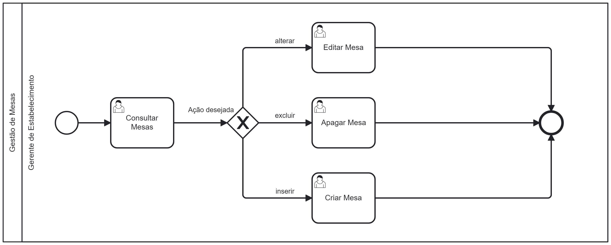

### 3.3.4 Processo 5 – Gerenciamento de Mesa

O processo de gestão de mesas está localizado no perfil do estabelecimento, onde são listadas as mesas que o estabelecimento possui. Este processo permite a consulta, a criação, a edição e a exclusão de mesas.

---

#### Detalhamento das atividades

### **1. Consultar Mesas**
**Descrição:** No perfil do estabelecimento, o Gerente de Estabelecimento pode visualizar as mesas disponíveis e tem a opção de criar mais mesas.  
**Objetivo:** Permitir a consulta das informações de cada mesa.

| **Campo**            | **Tipo**         | **Restrições**                | **Valor Default** |
|----------------------|------------------|-------------------------------|-------------------|
| Nome da Mesa         | Caixa de Texto   | Apenas Visualização           |                   |
| Descrição da Mesa    | Caixa de Texto   | Apenas Visualização           |                   |
| Capacidade da Mesa   | Numeral          | Apenas Visualização           | 1                 |

| **Comandos**         | **Destino**                    | **Tipo**          |
|----------------------|--------------------------------|-------------------|
| Editar               | Modal de edição de Mesa        | action            |
| Deletar              | Exclusão da Mesa               | delete            |

---

### **2. Editar Mesa**
**Descrição:** O Gerente de Estabelecimento pode editar as informações de uma mesa específica.  
**Objetivo:** Permitir a alteração dos dados de uma mesa.

| **Campo**            | **Tipo**         | **Restrições**                | **Valor Default** |
|----------------------|------------------|-------------------------------|-------------------|
| Nome da Mesa         | Caixa de Texto   | Apenas Visualização           |                   |
| Descrição da Mesa    | Caixa de Texto   |                               |                   |
| Capacidade da Mesa   | Numeral          |                               | 1                 |

| **Comandos**         | **Destino**                    | **Tipo**          |
|----------------------|--------------------------------|-------------------|
| Enviar               | Conclui a alteração            | confirm           |
| Cancelar             | Cancela a alteração            | cancel            |

---

### **3. Apagar Mesa**
**Descrição:** O Gerente de Estabelecimento pode excluir uma mesa.  
**Objetivo:** Permitir que o Gerente de Estabelecimento remova uma mesa do sistema.

| **Campo**            | **Tipo**         | **Restrições**                | **Valor Default** |
|----------------------|------------------|-------------------------------|-------------------|
| Nome da Mesa         | Caixa de Texto   | Apenas Visualização           |                   |

| **Comandos**         | **Destino**                    | **Tipo**          |
|----------------------|--------------------------------|-------------------|
| Apagar               | Confirma a exclusão            | confirm           |
| Cancelar             | Cancela a exclusão             | cancel            |

---

### **4. Criar Mesa**
**Descrição:** O Gerente de Estabelecimento pode criar uma nova mesa no sistema.  
**Objetivo:** Permitir a adição de uma nova mesa ao perfil do estabelecimento.

| **Campo**            | **Tipo**         | **Restrições**                | **Valor Default** |
|----------------------|------------------|-------------------------------|-------------------|
| Descrição da Mesa    | Caixa de Texto   |                               |                   |
| Capacidade da Mesa   | Numeral          |                               | 1                 |

| **Comandos**         | **Destino**                    | **Tipo**          |
|----------------------|--------------------------------|-------------------|
| Enviar               | Confirma a inserção            | confirm           |
| Cancelar             | Cancela a inserção             | cancel            |
