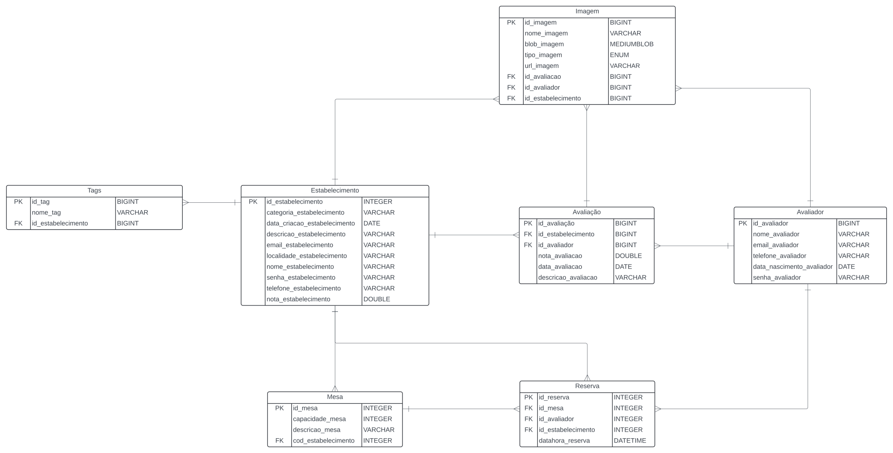

## 4. Projeto da solução

### 4.1. Modelo de dados

---

### 4.2. Tecnologias

O projeto *_Gostô?_* será desenvolvido utilizando as seguintes tecnologias:

| **Dimensão**   | **Tecnologia**              |
| ---            | ---                         |
| SGBD           | MySQL                       |
| Front end      | Astro + JS + CSS/Tailwind   |
| Back end       | Java SpringBoot Framework   |
| Deploy         | Vercel / Railway            |

Algumas ainda estão em processo de escolha definitiva, mas já se tem uma base de quais serão utilizadas e quais serão descartadas.
Essencialmente, o editor Visual Studio Code será priorizado no desenvolvimento deste projeto, assim como a utilização do Springboot (framework de Java), que está presente nos _requisitos não funcionais_. O deploy será, preferivelmente, feito utilizando a Vercel, mas a Railway não é descartada pois é bem falada quanto à hospedagem de APIs REST. O framework Astro será utilizado como uma forma criar componentes do frontend, assim reduzindo linhas de código e facilitando o desenvolvimento. Quanto ao SGDB, o escolhido foi o MySQL devido à familiaridade com a ferramenta, dada principalmente pelas aulas de Banco de Dados.
